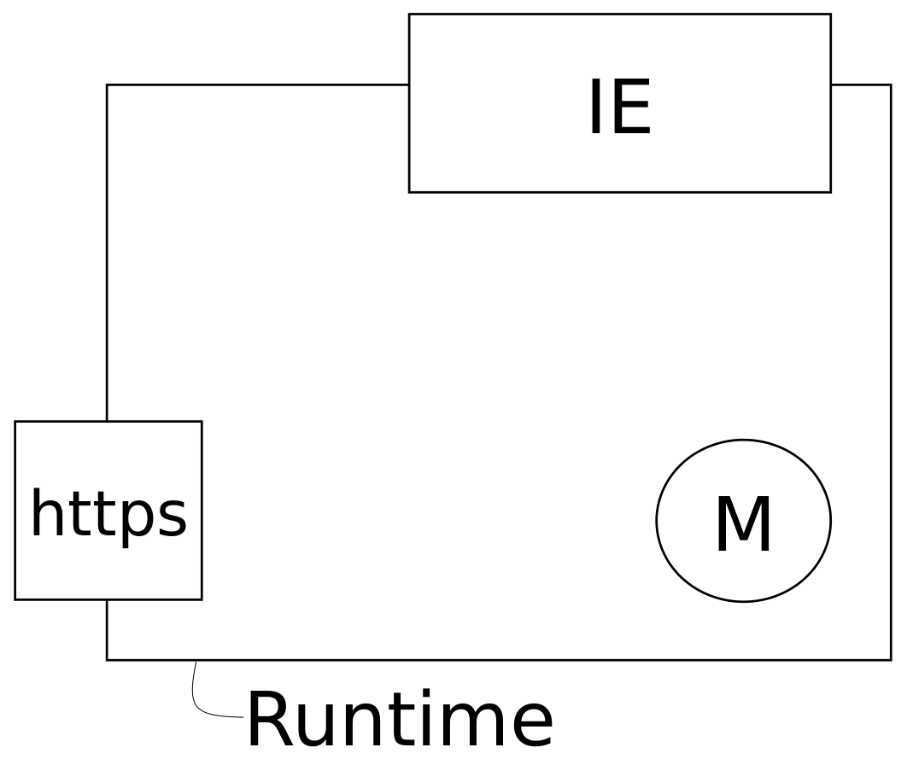
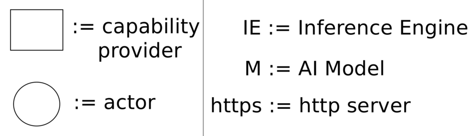
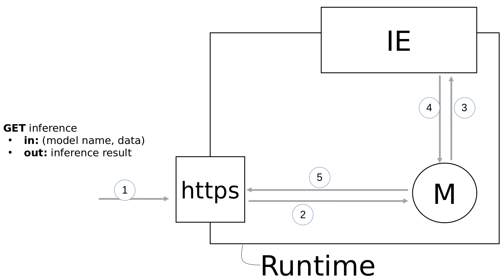
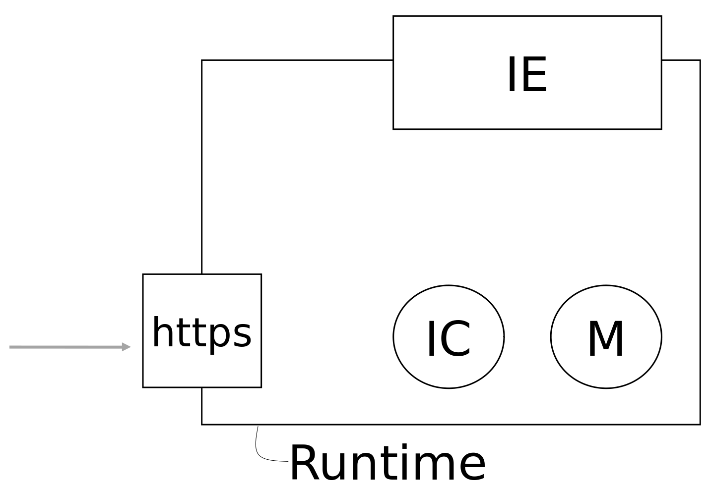
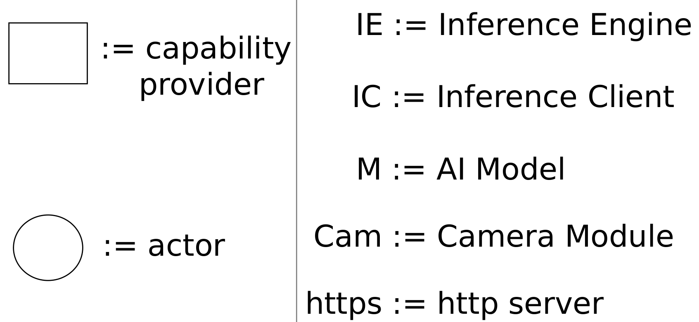
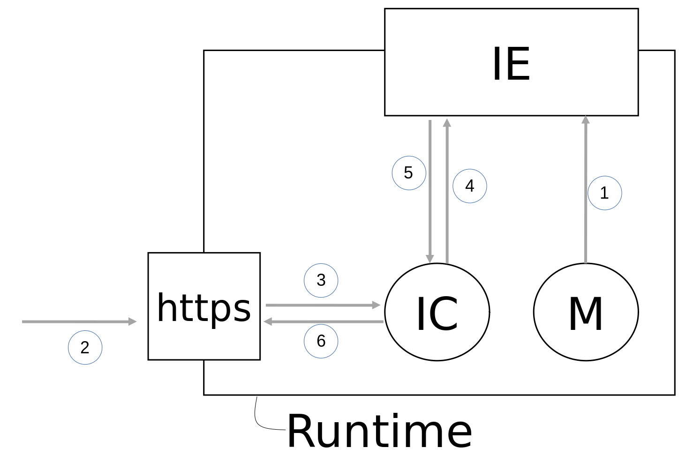
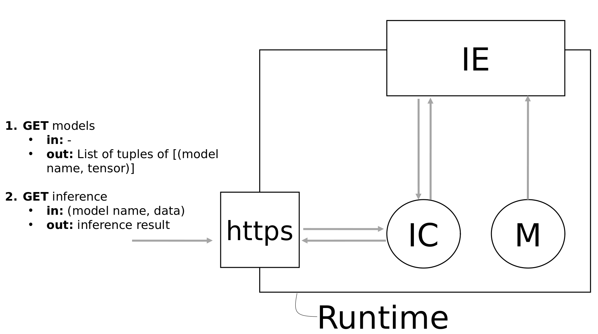
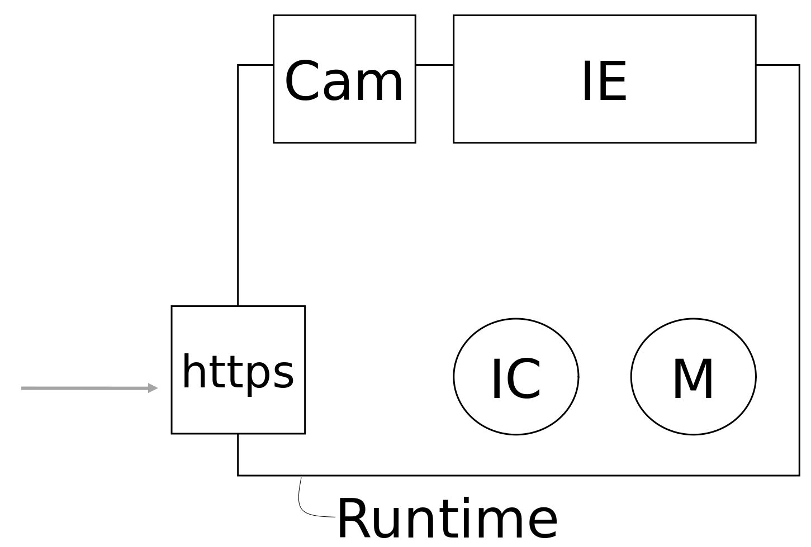

# MlInference

This repository provides a [wasmCloud](https://wasmcloud.dev/) capability provider and corresponding interface being designed to do __inference__ based on a given AI model.

## Preliminary design decisions

1. Inference shall be __IN__ scope
	
> **_[Information]_**  Other actions which are typical for the discipline of machine learning shall deliberately be excluded, e.g. training and data exploration.

2. The capability provider shall be implemented based on ([Tract's](https://github.com/sonos/tract/tree/68db0209c9ffd1b91dff82884f4ae03b3622dd34)) [ONNX](https://onnx.ai/) inference engine in a first iteration. Models from nearly all famous ML frameworks can be ported to ONNX format, so the *coverage* should be acceptable from the start.

3. The interface shall mimic [WASI-NN](https://github.com/WebAssembly/wasi-nn).

4. Any AI model used in this context shall be packaged in a (separate) actor.

## Design of possible example applications

### Most basic design

An most basic design of an example application may be illustrated as shown in the following screenshot. It comprises one actor (M) and two capability providers (https and IE). The actor (M) contains the AI model. The first capability provider (https) is an http-server providing an interface to the outside world. The second capability provider (IE) represents the inference engine.

> **_[Note]_**  The advantage of this design is that the appropriate interface closely mimics the one of [WASI-NN](https://github.com/WebAssembly/wasi-nn) with its five functions `load()`, `init_execution_context()`, `set_input()`, 
	`compute()` and `get_output()`. 

#### Data flow

When a request comes in (1) via the http-server (http) it is routed (2) to the actor (M). The actor (M) registers (3) at the inference engine (IE) in case it did not do so before and provides the data (3) to the inference engine (IE). The result is passed (4) from the inference engine (IE) back to the actor (M) which, in turn, passes (5) the result to the http-server (https) where it is sent as a response.

### More advanced design

A more advanced design additionally introduces an inference client (IC). The inference client (IC) communicates with the http-server (http) and the inference engine (IE) and may be regarded as a *reverse proxy* in that it deals with the opaque handles of the inference engine (IE) alias [GraphExecutionContext](https://github.com/Finfalter/wasmCloudArtefacts/blob/main/interfaces/mlinference/rust/src/mlinference.rs) internally but deals with (nick) names of AI models externally. 

> **_[Note]_**  The use of an inference client (IC) allows an easy deployment of multiple actors (M). However, the interface of such a design would differ from an interface of the basic design.

#### Data flow

The data flow in a more advanced design differs in two important points from the one in the most basic design:

1. If the actor (M) has to register its model at the inference engine (IE) prior to any inference request.
2. Most of the communication is now handled by the inference client (IC). After having registered the actor (M) may as well be removed from the system. 

The following screenshot illustrates the sequence of a possible inference request. It is done in two steps. A first, optional, step can be to query the available models. The second step is about the inference.

### Design with internal data source

It may be advantageous if the data source for inference is internal to the runtime. For example, the internal data source may be represented by a further capability provider (Cam) providing images. In this case it would be necessary to assign this capability provider (Cam) to the AI model of the appropriate actor (M).

## Backlog / Roadmap

### Lifecycle of AI models and tensors

* Further support of multiple Inference Engines (IE) in named capability provider, e.g. OpenVino.

* Consumers of the capability provider (cap) can register artifacts. The artifacts are stored in the cap. However, currently, none of the stored artefacts is ever removed. There should be a mechanism to remove artifacts in the cap.