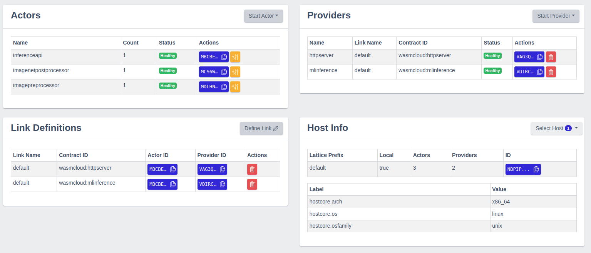

# MlInference

This repository provides a [wasmCloud](https://wasmcloud.dev/) 
capability provider and actors to perform __inference__ 
using machine learning models for ONNX and Tensorflow.

## Prerequisites

### Bindle

We recommand using [bindle version v0.7.1](https://github.com/deislabs/bindle/tags)
The latest version in github HEAD (as of March 2022) has not been released,
and includes signature checks, and are not compatible with the scripts
and models in this repo.


### Docker Compose

Make sure your Docker install has [Compose v2](https://docs.docker.com/compose/cli-command/#installing-compose-v2).


### Wasmcloud host

Download a wasmcloud host binary release for your platform from
[Releases](https://github.com/wasmCloud/wasmcloud-otp/releases) 
and unpack it. The path to the download folder should be set as
`WASMCLOUD_HOST_HOME` in `deploy/env` 


## Build actors and providers

From the top-level **directory** build with `make`. This should complete
without errors.


### Prepare models

Models (in `bindle/models`) must be loaded into the bindle server.

If you are using your own model, you will need to create a "bindle
invoice", a `.toml` file listing the bindle artifacts. Each artifact
has a sha256 hash and file size of each artifact. See the
existing toml files in `bindle/models` for examples.


### Configuration

Update paths in file `deploy/env` to match your development environment.

Be sure to set BINDLE and BINDLE_SERVER in `env` to the paths to the bindle cli
and bindle server executables, respectively. If they are in your $PATH,
you can just set these to `bindle` and `bindle-server`. If you built
bindle from git, use the 0.7.1 tag, run `cargo build`, and set
BINDLE_HOME to the path to the git repo. 


## Running

The script `deploy/run.sh` contains commands to run everything. In the
`deploy` folder, run `run.sh` to see a list of available subcommands.

Start the bindle server and load the models.

```
./run.sh bindle-start
./run.sh bindle-create
```

Start the local registry server, nats server, wasmcloud host,
actors, and providers. If this is your first time running running this
app, add `--console` to the end of the following command to open a new
terminal window with the host logs. The logs may be useful for
diagnosing any problems.

```
./run.sh all
# or, to open a $TERMINAL window with host logs
./run.sh all --console
```

After a successful startup the *washboard* should look similar to the following screenshot:

<div style="width: 80%; height: 50%">

</div>


If everything started correctly, try sending an image to be classified:
(try any of the images in `images/`, or try one of your own!

```
curl -T images/cat.jpg http://localhost:8078/mobilenetv27/matches | jq
```


To stop the host and providers,
```
/run.sh wipe
```
The above command stops everything except the bindle server.


To stop the bindle server,
```
./run.sh bindle-stop
```

Once the application is up and running, start to issue requests. Currently, the repository comprises the following pre-configured models:

* __*identity*__ of ONNX format
* __*plus3*__ of Tensorflow format
* __*mobilenet*__ of ONNX format
* __*squeezenet*__ of ONNX format

## Examples

Apart from the underlying inference engine, e.g. ONNX vs. Tensorflow, the pre-configured models differ in a further aspect: concerning the *trivial* models, one may request processing upon arbitrary shapes of one-dimensional data, `[1, n]`. [Mobilenet](https://github.com/onnx/models/tree/main/vision/classification/mobilenet) and [Squeezenet](https://github.com/onnx/models/tree/main/vision/classification/squeezenet), however, have more requirements regarding their respective input tensor. To fulfill these, the respective input tensor of an arbitrary image can be preprocessed before being routed to the inference engine.

The application provides three endpoints. The first endpoint routes the input tensor to the related inference engine without any pre-processing. The second endpoint __pre-processes__ the input tensor and routes it to the related inference engine thereafter. The third performs a pre-processing before the prediction step and a __post-processinging__ afterwards.

1. `0.0.0.0:<port>/<model>`, e.g. `0.0.0.0:7078/identity`
2. `0.0.0.0:<port>/<model>/preprocess`, e.g. `0.0.0.0:7078/squeezenetv117/preprocess`
3. `0.0.0.0:<port>/<model>/matches`, e.g. `0.0.0.0:7078/squeezenetv117/matches`

### Identity Model

To trigger a request against the __*identity*__ model, type the following:

```bash
curl -v POST 0.0.0.0:8078/identity -d '{"dimensions":[1,4],"valueTypes":["ValueF32"],"flags":0,"data":[0,0,128,63,0,0,0,64,0,0,64,64,0,0,128,64]}'
```

The response should comprise `HTTP/1.1 200 OK` as well as `{"result":"Success","tensor":{"dimensions":[1,4],"valueTypes":["ValueF32"],"flags":0,"data":[0,0,128,63,0,0,0,64,0,0,64,64,0,0,128,64]}}`

The following happens:

1. The http __*POST*__ sends a request for a model with name *"challenger"*, index `0` and some `data`.
2. `data` is vector `[1.0f32, 2.0, 3.0, 4.0]` converted to a vector of bytes.
3. A response is computed. The result is sent back.
4. The `data` in the request equals `data` in the response because the pre-loaded model "*challenger*" is one that yields as output what it got as input.

### Plus3 model

To trigger a request against the __*plus3*__ model, type the following:

```bash
curl -v POST 0.0.0.0:8078/plus3 -d '{"dimensions":[1,4],"valueTypes":["ValueF32"],"flags":0,"data":[0,0,128,63,0,0,0,64,0,0,64,64,0,0,128,64]}'
```

The response is

```bash
{"result":"Success","tensor":{"dimensions":[1,4],"valueTypes":["ValueF32"],"flags":0,"data":[0,0,128,64,0,0,160,64,0,0,192,64,0,0,224,64]}}
```

Note that in contrast to the __*identity*__ model, the answer from __*plus3*__ is not at all identical to the request. Converting the vector of bytes `[0,0,128,64,0,0,160,64,0,0,192,64,0,0,224,64]` back to a vector of `f32` yields `[4.0, 5.0, 6.0, 7.0]`. This was expected: each element from the input is incremented by three `[1.0, 2.0, 3.0, 4.0]` &rarr; `[4.0, 5.0, 6.0, 7.0]`, hence the name of the model: __*plus3*__.

### Mobilenet model

```bash
# in order for the relative path to match call from directory 'deploy'
curl -v POST 0.0.0.0:8078/mobilenetv27/preprocess --data-binary @../providers/mlinference/tests/testdata/images/n04350905.jpg
```

Note that the output tensor is of shape `[1,1000]` and needs to be post-processed by an evaluation of the [softmax](https://en.wikipedia.org/wiki/Softmax_function) over the outputs. In case the softmax shall be evaluated as well use the third endpoint, for example like the following:

```bash
# in order for the relative path to match call from directory 'deploy'
curl -v POST 0.0.0.0:8078/mobilenetv27/matches --data-binary @../providers/mlinference/tests/testdata/images/n04350905.jpg
```

### Squeezenet model

```bash
# in order for the relative path to match call from directory 'deploy'
curl -v POST 0.0.0.0:8078/squeezenetv117/preprocess --data-binary @../providers/mlinference/tests/testdata/images/n04350905.jpg
```

Note that the output tensor is of shape `[1,1000]` and needs to be post-processed where the post-processing is currently not part of the application. Or, including pos-processing as follows:

```bash
# in order for the relative path to match call from directory 'deploy'
curl -v POST 0.0.0.0:8078/squeezenetv117/matches --data-binary @../providers/mlinference/tests/testdata/images/n04350905.jpg
```

The answer should comprise

```bash
[{"label":"n02883205 bow tie, bow-tie, bowtie","probability":0.16806115},{"label":"n04350905 suit, suit of clothes","probability":0.14194612},{"label":"n03763968 military uniform","probability":0.11412828},{"label":"n02669723 academic gown, academic robe, judge's robe","probability":0.09906072},{"label":"n03787032 mortarboard","probability":0.09620707}]
```

## Creation of new bindles

The capability provider assumes a bindle to comprise two parcels where each parcel is assigned one of the following two groups:

* __*model*__
* __*metadata*__

The first, `model`, is assumed to comprise model data, e.g. an ONNX model. The second, `metadata`, is currently assumed to be json containing the metadata of the model. In case you create new bindles, make sure to assign these two groups.

## Supported Inference Engines

The capability provider uses the amazing inference toolkit [tract](https://github.com/sonos/tract) and currently supports the following inference engines

1. [ONNX](https://onnx.ai/)
2. [Tensorflow](https://www.tensorflow.org/)

### Restrictions

Concerning ONNX, see [tract's documentation](https://github.com/sonos/tract) for a detailed discussion of ONNX format coverage.

Concerning Tensorflow, only TensorFlow 1.x is supported, not Tensorflow 2. However, models of format Tensorflow 2 may be converted to Tensorflow 1.x. For a more detailled discussion, see the following resources:

* `https://www.tensorflow.org/guide/migrate/tf1_vs_tf2`
* `https://stackoverflow.com/questions/59112527/primer-on-tensorflow-and-keras-the-past-tf1-the-present-tf2#:~:text=In%20terms%20of%20the%20behavior,full%20list%20of%20data%20types.`

Currently, there is no support of any accelerators like GPUs or TPUs. On the one hand, there is a range of [coral devices](https://coral.ai/products/) like the [Dev board](https://coral.ai/docs/dev-board/get-started) supporting Tensorflow for TPU based inference. However, they only support the [Tensorflow Lite](https://www.tensorflow.org/lite) derivative. For more information see Coral's [Edge TPU inferencing overview](https://coral.ai/docs/edgetpu/inference/).
