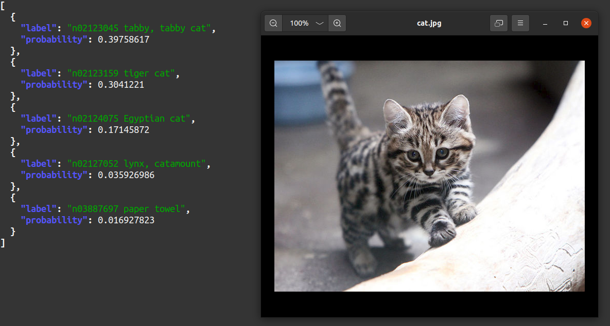
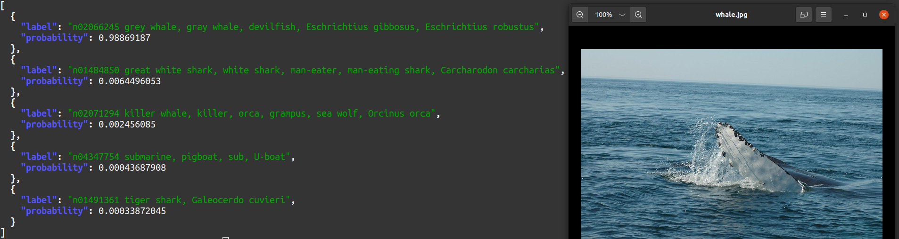
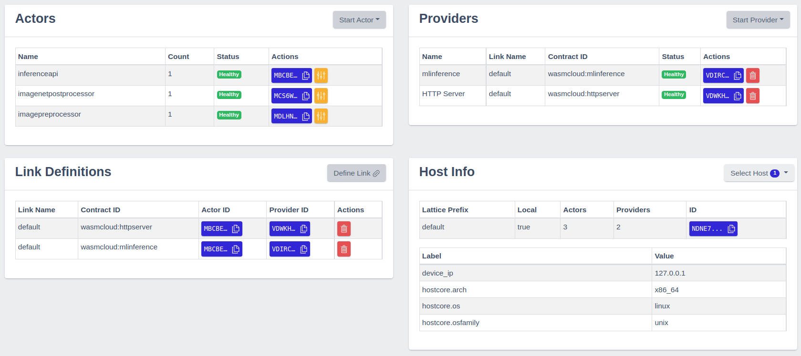
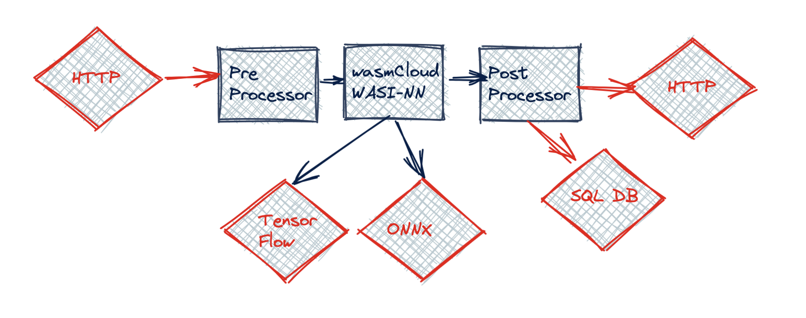

# Machine Learning with wasmCloud

These pages are supposed to document how to set up and deploy machine learning applications based on [wasmCloud](https://wasmcloud.dev/).

The current focus narrows any type of machine learning application to the use-case of __*prediction*__ aka __*inferencing*__. Some applied examples may look like the following:

```bash
curl --silent -T ../images/cat.jpg localhost:8078/mobilenetv27/matches | jq
```


*image classification with data from [imagenet](https://www.image-net.org/)*

```bash
curl --silent -T ../images/whale.jpg localhost:8078/mobilenetv27/matches | jq
```


*image classification with data from [imagenet](https://www.image-net.org/)*

## Structure

- [Machine Learning with wasmCloud](#machine-learning-with-wasmcloud)
  - [Structure](#structure)
  - [General architecture](#general-architecture)
    - [Operation's perspective](#operations-perspective)
    - [Development's perspective](#developments-perspective)
  - [Build and Run](#build-and-run)
    - [Prerequisites](#prerequisites)
      - [Wasmcloud host](#wasmcloud-host)
      - [Bindle](#bindle)
    - [Targets](#targets)
  - [Supported Inference Engines](#supported-inference-engines)
  - [Preloaded Models](#preloaded-models)
  - [Restrictions](#restrictions)

## General architecture

In order to be able to do inferencing one has to solve other challenges as model provisioning and the deployment of application software before. Since these kinds of requirements are usually assigned to __*"Operations"*__, this is what is discussed first.

### Operation's perspective

From a high-level perspective each machine learning application in this scope comprises three different artifacts: a ([wasmCloud](https://wasmcloud.dev/)) __runtime__, a ([bindle](https://github.com/deislabs/bindle)) __model repository__ and an __OCI registry__.

Before any deployment, the runtime does not host any application. The model repository is designed to host (binary) AI models as well as their (human readable) metadata. The OCI registry is where the business logic resides. The following screenshot roughly depicts the overall architecture.


*Application's architecture from an operation's point of view*

Information about the runtime, including hosted artifacts, can easily accessed via the __washboard__, wasmcloud's web UI. Per default, the washboard is accessible via [http://localhost:4000/](http://localhost:4000/) as soon as the runtime is up and running.


*monitoring of wasmcloud's runtime via the washboard*

### Development's perspective

The development's point of view focuses the runtime. There are two [capability providers](https://wasmcloud.dev/reference/host-runtime/capabilities/), https-server and mlinference as well as three [actors](https://wasmcloud.dev/reference/host-runtime/actors/), API, post-processor and pre-processor. The following screenshot roughly depicts the overall architecture from a developer's perspective.


*structure of a generic machine learning application*


*data flow*

## Build and Run

### Prerequisites

#### Wasmcloud host

Download a wasmcloud host binary release for your platform from [Releases](https://github.com/wasmCloud/wasmcloud-otp/releases)
and unpack it. The path to the download folder should be set as `WASMCLOUD_HOST_HOME` in `deploy/env`.

#### Bindle

We recommand using [bindle version v0.7.1](https://github.com/deislabs/bindle/tags). The latest version in github HEAD (as of March 2022) has not been released, and includes signature checks which are not compatible with the scripts in this repo.

### Targets

- [x86_64 Linux](./x86_64-linux.html)
- [aarch64 Linux](./aarch64-linux.html) (Coral dev board)

## Supported Inference Engines

The capability provider __mlinference__ uses the amazing inference toolkit [tract](https://github.com/sonos/tract) and currently supports the following inference engines

1. [ONNX](https://onnx.ai/)
2. [Tensorflow](https://www.tensorflow.org/)

## Preloaded Models

Once the application is up and running, start to issue requests. Currently, the repository comprises the following pre-configured models:

- __identity__ of ONNX format
- __plus3__ of Tensorflow format
- __mobilenetv2.7__ of ONNX format, e.g. `curl --silent -T ../images/lighthouse.jpg localhost:8078/mobilenetv27/matches | jq`
- __squeezenetv1.1.7__ of ONNX format, e.g. `curl --silent -T ../images/piano.jpg localhost:8078/squeezenetv117/matches | jq`

## Restrictions

Concerning ONNX, see [tract's documentation](https://github.com/sonos/tract) for a detailed discussion of ONNX format coverage.

Concerning Tensorflow, only TensorFlow 1.x is supported, not Tensorflow 2. However, models of format Tensorflow 2 may be converted to Tensorflow 1.x. For a more detailled discussion, see the following resources:

- [tf1 vs tf2](https://www.tensorflow.org/guide/migrate/tf1_vs_tf2)
- [primer on tensorflow and keras - the past tf1 and the present tf2](https://stackoverflow.com/questions/59112527/primer-on-tensorflow-and-keras-the-past-tf1-the-present-tf2#:~:text=In%20terms%20of%20the%20behavior,full%20list%20of%20data%20types)

Currently, there is no support of any accelerators like GPUs or TPUs. On the one hand, there is a range of [coral devices](https://coral.ai/products/) like the [Dev board](https://coral.ai/docs/dev-board/get-started) supporting Tensorflow for TPU based inference. However, they only support the [Tensorflow Lite](https://www.tensorflow.org/lite) derivative. For more information see Coral's [Edge TPU inferencing overview](https://coral.ai/docs/edgetpu/inference/).