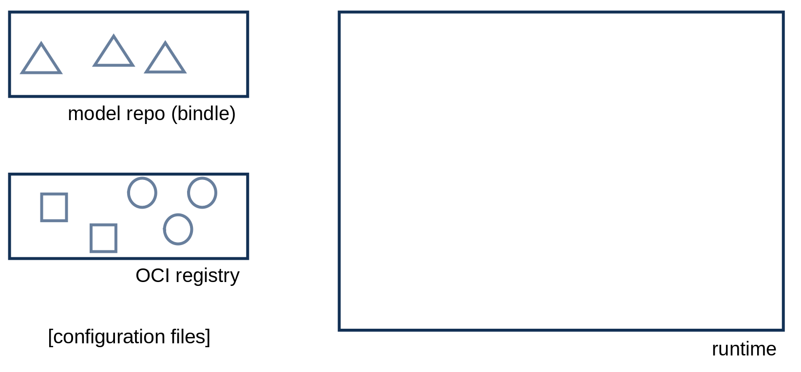
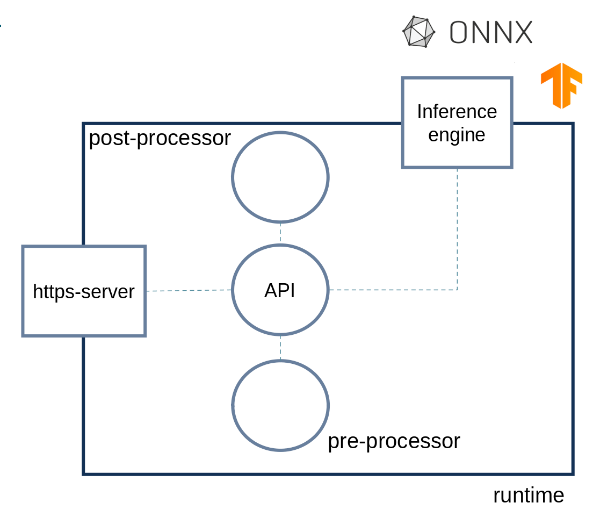
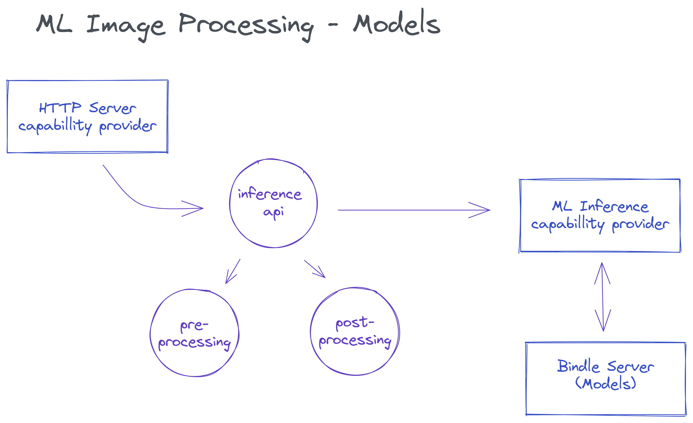

# Machine Learning with wasmCloud

These pages are supposed to document how to set up and deploy machine learning applications based on [wasmCloud](https://wasmcloud.dev/).

The current focus narrows any type of machine learning application to the use-case of __*prediction*__ aka __*inferencing*__.

## Structure

- [Machine Learning with wasmCloud](#machine-learning-with-wasmcloud)
  - [Structure](#structure)
  - [Machine Learning applications](#machine-learning-applications)
    - [Operation's perspective](#operations-perspective)
    - [Development's perspective](#developments-perspective)
  - [Build and Run](#build-and-run)
    - [Prerequisites](#prerequisites)
      - [Wasmcloud host](#wasmcloud-host)
      - [Bindle](#bindle)

## Machine Learning applications

> **TODO** some nice intro

### Operation's perspective

*Application's architecture from an operation's point of view*

### Development's perspective

*structure of a generic machine learning application*

*data flow*

## Build and Run

### Prerequisites

#### Wasmcloud host

Download a wasmcloud host binary release for your platform from [Releases](https://github.com/wasmCloud/wasmcloud-otp/releases)
and unpack it. The path to the download folder should be set as `WASMCLOUD_HOST_HOME` in `deploy/env`.

#### Bindle

We recommand using [bindle version v0.7.1](https://github.com/deislabs/bindle/tags). The latest version in github HEAD (as of March 2022) has not been released, and includes signature checks which are not compatible with the scripts in this repo.

- On [x86_64 Linux](./x86_64-linux)
- On [aarch64 Linux](./aarch64-linux.html) (Coral dev board)
